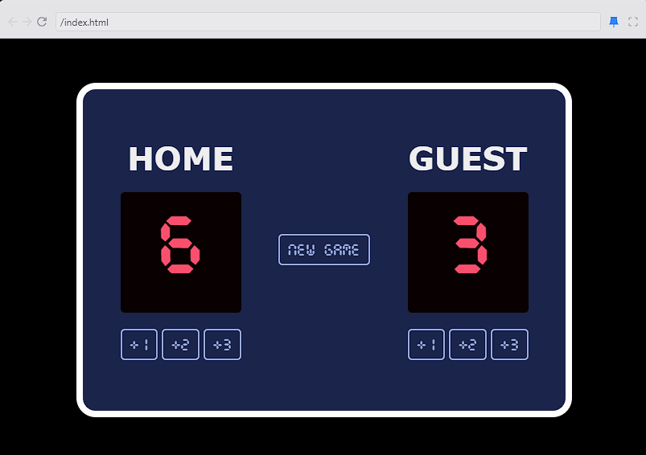

# 🏀 <span style="color: #FF4500;">Basketball Scoreboard</span>

[](https://github.com/sunqfuu/Scoreboard/stargazers)
[](https://github.com/sunqfuu/Scoreboard/network/members)
[](LICENSE)

## Overview

Welcome to the **<span style="color: #1E90FF;">Basketball Scoreboard</span>** project! 🎉 This digital scoreboard is built with HTML, CSS, and JavaScript. It lets you track scores for two teams—**Home** and **Guest**—with a retro, interactive design that brings back the classic arcade feel.

## Table of Contents

- [Features ⚡](#features-)
- [Technologies 🔧](#technologies-)
- [Demo 🎮](#demo-)
- [Getting Started 🚀](#getting-started-)
- [Customization 🎨](#customization-)
- [Future Enhancements 🔮](#future-enhancements-)
- [Contributing 🛠️](#contributing-)
- [License 📄](#license-)
- [Contact 📬](#contact-)

## Features ⚡

- **Increment Score:** Easily add <span style="color: #32CD32;">+1</span>, <span style="color: #32CD32;">+2</span>, or <span style="color: #32CD32;">+3</span> points for each team.
- **New Game Button:** Reset scores quickly to start a fresh game.
- **Retro Digital Display:** A nostalgic, arcade-inspired look.
- **Responsive Design:** Optimized for all screen sizes, from mobile to desktop.

## Technologies 🔧

- **HTML:** Structures the application.
- **CSS:** Styles and layouts with responsive design.
- **JavaScript:** Provides the interactive functionality.

## Demo 🎮

To see the scoreboard in action, simply open the `https://scorebasket1.netlify.app/` page on your browser.

> **Note:** Replace the placeholder image below with a screenshot of your project.



## Getting Started 🚀

Follow these steps to set up the project locally:

1. **Clone the Repository:**

   ```bash
   git clone https://github.com/sunqfuu/Scoreboard.git
